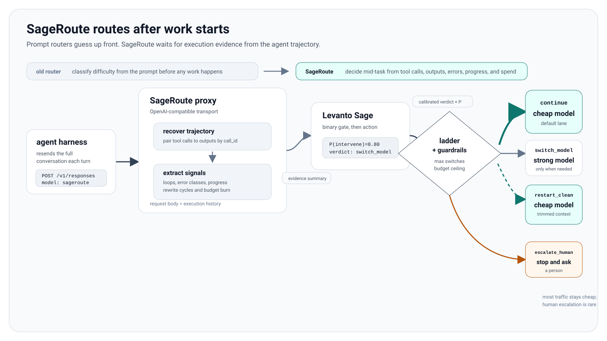
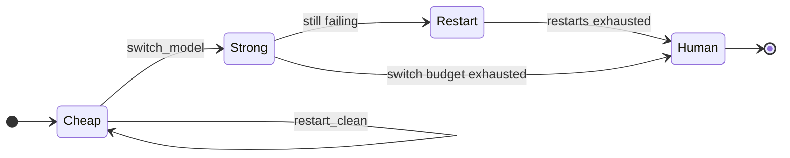

<h1 align="center">SageRoute</h1>

<p align="center">
  <strong>A trajectory-aware model router.</strong><br>
  Start every task on a cheap model. Watch what the agent actually does. Escalate only when the evidence says it is struggling.
</p>

<p align="center">
  <a href="#quick-start">Quick start</a> &middot;
  <a href="#how-it-works">How it works</a> &middot;
  <a href="docs/configuration.md">Configuration</a> &middot;
  <a href="docs/architecture.md">Architecture</a> &middot;
  <a href="docs/decision-model.md">Decision model</a>
</p>

<p align="center">
  
  
  
  
  
</p>

---

## The problem

Agent frameworks pick a model once, at the start, from the prompt. That is a guess made at the worst possible moment, because prompts lie about difficulty in both directions. "Fix the typo in the header" turns into a four-hour dependency bisect. "Rewrite the scheduler" turns out to be a one-line change.

So teams pick one of two bad defaults. Run everything on a frontier model and pay frontier prices for tasks a small model would have finished in one turn. Or run everything cheap and watch agents thrash: rewriting the same file, re-running the same failing test, burning an hour and a full context window before failing anyway.

**SageRoute makes the decision later, when there is actually something to look at.**

Every task starts cheap. Each turn, the proxy reads what the agent did, not what it said: which tools it called, which commands failed and with what error class, whether it is looping, whether anything has actually passed, and how much has been spent. That evidence goes to the [Levanto Sage](https://docs.levanto.ai/) decision API, which returns a calibrated verdict: keep going, hand it to a stronger model, wipe the polluted context and restart, or stop and get a human.

```text
Turn 1-2   cheap model    tests failing, first attempt         continue
Turn 3     cheap model    same AssertionError, 2nd rewrite     continue  (P=0.41, below gate)
Turn 4     cheap model    3rd rewrite, still red, no progress  switch_model  (P=0.80)
Turn 5     strong model   ...
```

The cheap model gets the easy 80 percent. The expensive model gets called in when the work proves it is needed, and not one turn earlier.

## Why a proxy

An agent harness resends its entire conversation on every turn. That request body *is* the execution history: every tool call, every output, every error, in order.

A proxy sees it for free, on a request it is already handling, for every turn of every session. No SDK, no callbacks, no changes to your agent.

<p align="center">
  <picture>
    <source media="(prefers-color-scheme: dark)" srcset="docs/assets/architecture-dark.svg">
    <source media="(prefers-color-scheme: light)" srcset="docs/assets/architecture-light.svg">
    
  </picture>
</p>

This is not packaging around a router. It is the only place in the stack where trajectory-aware routing is possible without asking anyone to rewrite their agent.

## Quick start

```bash
git clone https://github.com/codejunkie99/sageroute
cd sageroute
bun install
```

Requires [Bun](https://bun.sh) 1.1+.

```bash
echo "SAGE_API_KEY=lv_..." > .env   # https://docs.levanto.ai/
bun run serve                       # listens on 127.0.0.1:8787
```

That is the whole setup. There is no config file to copy or hand-edit: `serve` generates
one on first run from the credentials that already exist on this machine, validates it,
prints the ladder, and starts listening. Bun loads `.env` automatically, so the Sage key
survives a new shell without re-exporting anything.

```text
no config at ./sageroute.config.json; generating one
wrote ./sageroute.config.json
  openai uses your stored ChatGPT subscription login
  anthropic uses your stored Claude subscription login

ladder
  cheap   openai/gpt-5.4-mini  [oauth subscription]
  strong  anthropic/claude-sonnet-4-5-20250929  [oauth subscription]
  sage    https://sage.levanto.ai

sageroute listening on http://127.0.0.1:8787
```

No credentials yet? Run `sageroute auth login anthropic` to use a Claude Pro/Max plan, or
put `OPENAI_API_KEY` in `.env`. Run `bun run init --force` to regenerate the config after
adding credentials, and `bun run check` any time to see which credential each tier
resolves to.

Point any OpenAI-compatible client at it and ask for the router by name:

```bash
curl http://127.0.0.1:8787/v1/responses \
  -H 'Content-Type: application/json' \
  -d '{"model":"sageroute","input":"refactor the auth module","prompt_cache_key":"task-1"}'
```

For any harness that reads the standard environment variables:

```bash
export OPENAI_BASE_URL=http://127.0.0.1:8787/v1
export OPENAI_MODEL=sageroute
```

Nothing else changes. The harness thinks it is talking to one model. It is talking to a ladder.

## Connecting a coding agent

SageRoute accepts the two wire formats real coding agents speak, so the harness you
already use attaches without a plugin or a patched client. Requests entering on either
wire are translated into one internal shape, routed by the same trajectory logic, and
translated back. The client never learns a translation happened.

### Codex CLI

Codex speaks the Responses API, which is SageRoute's native path. Add a provider block to
`~/.codex/config.toml`:

```toml
model = "sageroute"
model_provider = "sageroute"

[model_providers.sageroute]
name = "SageRoute"
base_url = "http://127.0.0.1:8787/v1"
wire_api = "responses"
```

Codex sends `prompt_cache_key` on every turn, which is a stable per-conversation value,
so session state lines up exactly with one Codex conversation.

### Claude Code

Claude Code speaks the Anthropic Messages API, which SageRoute serves at `/v1/messages`:

```bash
export ANTHROPIC_BASE_URL=http://127.0.0.1:8787
export ANTHROPIC_MODEL=sageroute
export ANTHROPIC_API_KEY=unused   # any value; set authToken to require a real one
claude
```

Claude Code's tool calls and tool results arrive as content blocks nested inside
messages. SageRoute lifts them into a flat action sequence before routing, because a tool
result buried in a user message is invisible to the evidence layer and every turn would
look like an agent that never ran anything. Its `is_error` flag is carried through as an
explicit failure signal rather than being re-derived by sniffing output text.

Both harnesses can point at the same running proxy at the same time. Sessions are keyed
independently, so a Codex conversation and a Claude Code conversation never share a
ladder or a budget.

### Anything else

Any OpenAI-compatible client works through `/v1/responses` or `/v1/chat/completions`, and
any Anthropic-compatible client through `/v1/messages`. The routed alias requires
`/v1/responses` or `/v1/messages`, since those are the two wires that carry the tool-call
history the router reasons about.

### Subscription OAuth

SageRoute can also authenticate OpenAI and Anthropic providers with an existing ChatGPT Plus/Pro or Claude Pro/Max subscription login instead of a metered API key.

```bash
sageroute auth login openai
sageroute auth login anthropic
sageroute auth status
```

If the Codex CLI or Claude Code has already logged in on this machine, skip the browser
entirely and adopt the credential they already hold:

```bash
sageroute auth import          # every login found
sageroute auth import openai   # just one provider
```

```text
Imported openai as you@example.com from Codex CLI
  source  /Users/you/.codex/auth.json
  status  expires at 8/7/2026, 12:17:13 AM
```

This reads `~/.codex/auth.json` and `~/.claude/.credentials.json` and never writes to
them. No new grant is created, so logging out of the original tool revokes this too.
It also works headless, where the browser flow cannot run at all.

Then omit `apiKey` for those providers. The default `authMode: "auto"` uses a resolved API key when one is configured, otherwise keyless `anthropic` providers and keyless `openai` providers pointed at the ChatGPT Codex backend use the stored subscription login:

```json
{
  "providers": {
    "openai": {
      "adapter": "openai-responses",
      "baseUrl": "https://chatgpt.com/backend-api/codex",
      "models": ["gpt-5.4-mini"]
    },
    "anthropic": {
      "adapter": "anthropic-messages",
      "baseUrl": "https://api.anthropic.com/v1",
      "models": ["claude-sonnet-4-5-20250929"]
    }
  }
}
```

Use explicit `authMode: "oauth"` only when you want to force subscription auth and reject a stray `apiKey`. Providers without a login flow, such as xAI and Kimi, stay on API keys.

Credentials are stored in `~/.sageroute/auth.json` with a `0700` directory and `0600` file. Expired access tokens refresh automatically before an upstream request; if no valid login is available, the proxy returns a 401 with the exact `sageroute auth login <provider>` command and does not call upstream.

A subscription OAuth token is not a general API credential. It is accepted only when the request looks like the vendor's first-party client. For ChatGPT, configure `https://chatgpt.com/backend-api/codex`; SageRoute sends the stored `ChatGPT-Account-Id` when the login exposes one, pins `store: false`, and strips stored item ids while preserving `call_id` tool pairing. For Anthropic, SageRoute sends bearer auth, the OAuth beta and Claude Code fingerprint headers, and makes the first system block the Claude Code identity while preserving the caller's system prompt as a later block.

### Docker

```bash
docker build -t sageroute .
docker run --rm -p 8787:8787 \
  -e SAGE_API_KEY -e OPENAI_API_KEY \
  -v "$PWD/sageroute.config.json:/app/sageroute.config.json:ro" \
  sageroute
```

## How it works

### 1. Evidence, not self-report

Each turn the inbound `input` array is replayed into a typed trajectory: `function_call` items paired to their `function_call_output` by `call_id`, in the order the agent issued them.

A model's own reasoning never becomes evidence on its own. It is reduced to counts, classes, and digests. A model announcing "I've got this now" for the fifth time is not evidence of progress. A passing test is.

### 2. Deterministic detectors run first

Local, free, and honest. These run before Sage is consulted at all:

| Detector | Fires when | The failure it catches |
| --- | --- | --- |
| Action/observation repeat | Same call, same output, 3x | The agent has stopped learning |
| Repeated error class | Same failure category back to back, 3x | Stuck on one wall |
| Ping-pong | Two actions alternating, 4x | Oscillating between two wrong fixes |
| Rewrite/retest cycles | write, fail, write, fail | Understands the shape, cannot solve it |
| Steps since progress | No successful execution for N steps | Motion without movement |

That fourth one is the interesting case. An agent that rewrites a file differently every time never repeats an identical action, so naive loop detection stays silent while it burns the entire budget. And progress deliberately means *a successful execution*, not a file write: counting a rewrite as progress is exactly what lets a thrashing agent look healthy, because it rewrites, the test fails, it rewrites again, and a naive counter resets every single time.

### 3. A two-stage Sage call

Stage one is a binary gate: is this agent failing badly enough to intervene at all? Most checkpoints end there, for the price of one cheap call.

Stage two runs only if the gate fires, and asks which of four actions to take.

This split was not the original design. Asking only the four-way question under-escalated badly: `choice` probabilities are independent sigmoids that do not sum to 1, so every option clustered in the same narrow band and a confidence floor on the argmax rejected real signal. The binary gate separates the same trajectories cleanly. The full postmortem is in [docs/decision-model.md](docs/decision-model.md).

### 4. Guardrails, because a verdict is not a policy



- **Budget stop runs before any network call.** Spend limits are policy, never delegated to a model. An exhausted budget must not spend more money asking whether it should stop.
- **Capability before retry.** A restart hands the same task back to the same weak model. That helps when context is polluted, never when the model simply cannot do the work. On the cheap tier with a switch available, climb first.
- **Asymmetric hysteresis.** The first cheap-to-strong hop is the cheapest, most reversible move on the ladder, so it fires on one bad checkpoint. Restarts and human escalation are disruptive, so they need repeated agreement.
- **The ladder is one-way.** Already strong and still failing? Next rung is a restart, then a human. Never a demotion.
- **Fail open.** If Sage is unreachable, the agent keeps working. A router outage must not take the agent down with it.

### 5. Restarts keep the artifacts, drop the confusion

On `restart_clean` the forwarded request is rebuilt: the task, the tool calls, and their real outputs stay; the assistant's narration and `reasoning` items are dropped. The next model inherits facts and artifacts, not the dead ends that caused the escalation.

It is also required for correctness across vendors, since reasoning items carry provider-specific encrypted payloads another provider cannot decrypt.

## What you get back

Every routed response carries its decision on the wire, so you can see routing without reading logs:

```http
x-sageroute-model:        openai/gpt-4.1
x-sageroute-tier:         strong
x-sageroute-action:       switch_model
x-sageroute-intervention: 0.796
x-sageroute-source:       sage
```

And `GET /v1/sageroute/sessions` returns the full decision history per session, with the running cost ledger.

## Endpoints

| Route | Purpose |
| --- | --- |
| `POST /v1/responses` | Main path. Routed when `model` is the alias, passed through otherwise |
| `POST /v1/messages` | Anthropic Messages wire, for Claude Code. Routed on the alias, translated both ways |
| `POST /v1/chat/completions` | Passthrough for non-alias models |
| `GET /v1/models` | The router alias plus every configured `provider/model` |
| `GET /v1/sageroute/sessions` | Per-session tier, cost, switches, and decision history |
| `GET /health` | Liveness |

## Supported providers

Four vendors, deliberately. A router needs depth on the providers people actually build agents on, not a long tail of half-tested integrations.

| Provider | Adapter | Endpoint |
| --- | --- | --- |
| OpenAI | `openai-responses` | `/responses` |
| Anthropic | `anthropic-messages` | `/messages` |
| xAI | `openai-chat` | `/chat/completions` |
| Kimi (Moonshot) | `openai-chat` | `/chat/completions` |

xAI and Kimi both expose OpenAI-compatible Chat Completions, so they are a base URL and a key. Anthropic is the one that genuinely differs, so it gets a real adapter in [src/proxy/anthropic.ts](src/proxy/anthropic.ts): `system` is a top-level field rather than a message, `max_tokens` is required, tool calls and results are content blocks instead of a parallel array, and streaming is a typed event protocol whose token counts arrive split across two frames.

That last detail matters more than it looks. `message_start` carries input tokens and `message_delta` carries the final output count, so an adapter that reads only one of them undercounts every streaming turn and the budget guardrail silently stops working.

Because every adapter normalizes to the Responses shape, the ladder can cross vendors: run cheap on Kimi and strong on Anthropic, and the decision engine never learns they are different.

## Configuration

```json
{
  "port": 8787,
  "providers": {
    "kimi": {
      "adapter": "openai-chat",
      "baseUrl": "https://api.moonshot.ai/v1",
      "apiKey": "${KIMI_API_KEY}"
    },
    "anthropic": {
      "adapter": "anthropic-messages",
      "baseUrl": "https://api.anthropic.com/v1",
      "apiKey": "${ANTHROPIC_API_KEY}"
    }
  },
  "sageRoute": {
    "cheap":  { "provider": "kimi", "model": "kimi-k2.5" },
    "strong": { "provider": "anthropic", "model": "claude-sonnet-4-5-20250929" },
    "apiKey": "${SAGE_API_KEY}",
    "budgetUsd": 5.0
  }
}
```

Every credential field supports `${VAR}`, `$VAR`, and `env:VAR` indirection. Provider `apiKey` references fail validation only when that key is the credential SageRoute will actually use; under the default `authMode: "auto"`, an unset key can fall through to OAuth for `anthropic` or for `openai` at the ChatGPT Codex backend.

Full reference, including every default and validation rule: **[docs/configuration.md](docs/configuration.md)**.

## Project layout

```text
src/core/     the decision engine, with zero transport imports
  evidence.ts   trajectory recovery from the request body
  signals.ts    loop, stall, and thrash detectors
  sage.ts       Levanto Sage client, plus a deterministic offline stub
  policy.ts     the ladder and its guardrails
  session.ts    per-session state, cost ledger, eviction
  router.ts     the per-turn decision
src/proxy/    the OpenAI-compatible server
  config.ts     loading, secret indirection, validation, SSRF guard
  upstream.ts   Responses and Chat Completions adapters, usage metering
  anthropic.ts  outbound: internal shape -> Anthropic, for talking TO Claude
  inbound-anthropic.ts  inbound: Anthropic -> internal shape, for Claude Code
  server.ts     routing table, auth, passthrough
src/cli.ts    serve and check
```

`src/core` imports nothing from `src/proxy`. The decision engine is independently testable and could be embedded elsewhere; the proxy is one delivery mechanism for it, not the thing itself.

## Testing

```bash
bun test tests/      # 154 tests
bun run typecheck
```

There is also a live proof. `examples/live-e2e.ts` boots the real proxy over a real socket, drives genuine failing and healthy trajectories through it, and calls the **real** Sage API for every verdict, with a local stub standing in for the model provider. It asserts on which model the upstream actually received, because a routing decision is only real if it changes where the traffic goes.

```bash
export SAGE_API_KEY=lv_...
bun run examples/live-e2e.ts
```

Most recent run:

```text
--- failing trajectory (real Sage) ---
  turn 1: strong switch_model   P(intervene)=0.796 src=sage -> stub/strong-model
  upstream saw: strong-model, strong-model, ...
  PASS  escalated off the cheap tier
  PASS  the escalation reached the real upstream

--- healthy trajectory (real Sage) ---
  turn 2: cheap  continue       P(intervene)=0.005 src=sage -> stub/cheap-model
  PASS  stayed on the cheap tier throughout
  PASS  never sent a healthy turn to the expensive model

--- budget guardrail ---
  turn 2: strong escalate_human P(intervene)=0.000 src=local -> stub/strong-model
  PASS  the budget stop was decided locally, without paying Sage
```

## Status and honest limitations

Early, but real and running. What is proven: the decision engine, the proxy transport, and the ladder end to end against the live Sage API, plus real turns answered by a real vendor through a ChatGPT subscription login.

What is **not** yet proven, stated plainly:

- The routing proof (`examples/live-e2e.ts`) uses a **stub upstream**, so it validates which model a decision sends work to, not real model quality deltas. Measuring actual task outcomes and dollar savings against two real models is the next step.
- `examples/live-subscription.ts` does hit the real ChatGPT backend and returns genuine model output, but it only proves the transport is one the vendor accepts. It routes a single cheap tier and never exercises an escalation.
- Anthropic subscription auth has **not** been exercised against the live vendor; only OpenAI has. The Anthropic path is covered by protocol-level tests and stub servers over real sockets.
- A real interactive browser `auth login` has still never been run here. The live OpenAI calls used a credential adopted from the Codex CLI via `auth import`, which exercises token use and refresh but not the authorization-code flow itself.
- Subscription terms of service are the user's responsibility.
- Thresholds and the intervention gate default were chosen by reasoning and small-scale testing, not by tuning on a large benchmark.
- Session state is in-memory and per-process. A multi-replica deployment will route each replica independently.
- Not battle-tested at scale.

## Roadmap

- [ ] Benchmark on a real agent suite: measure resolve rate and cost against always-cheap and always-strong baselines
- [ ] More than two rungs on the ladder
- [ ] Persistent session state so replicas share routing decisions
- [ ] Native adapters where the Chat Completions shim leaks (reasoning-token accounting on xAI and Kimi)
- [ ] Prometheus metrics endpoint
- [ ] Tune thresholds from collected trajectories

## Documentation

| Document | What is in it |
| --- | --- |
| [docs/architecture.md](docs/architecture.md) | Request lifecycle, module boundaries, and why they sit where they do |
| [docs/configuration.md](docs/configuration.md) | Complete config reference, validation rules, worked examples |
| [docs/decision-model.md](docs/decision-model.md) | Every detector, the Sage protocol, and each guardrail with its reasoning |
| [CONTRIBUTING.md](CONTRIBUTING.md) | Setup, conventions, and how to change the decision policy safely |
| [SECURITY.md](SECURITY.md) | Key handling, the SSRF guard, and what is sent to Sage |

## Contributing

Contributions are welcome. Please read [CONTRIBUTING.md](CONTRIBUTING.md) first. Changes to `src/core/policy.ts` need test coverage and, ideally, live end-to-end evidence, because that file decides when someone's money gets spent.

## Acknowledgements

Decision verdicts are provided by [Levanto Labs' Sage API](https://docs.levanto.ai/), which returns calibrated probabilities rather than prose. That is what makes a router possible: you can threshold a probability, but you cannot threshold a paragraph.

## License

[MIT](LICENSE)
