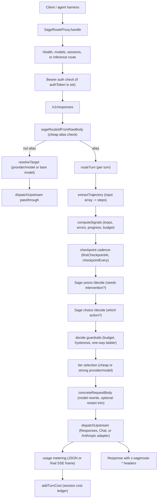
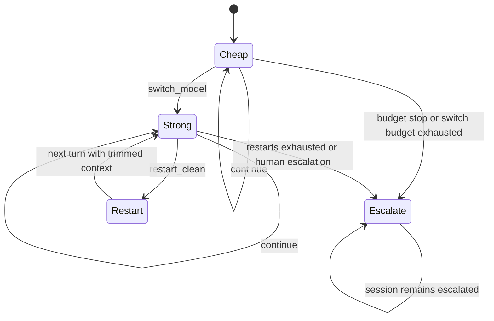

# Architecture

SageRoute is an HTTP proxy with a trajectory-aware routing core. The proxy receives the same request an agent harness was already going to send upstream, recovers the execution trajectory from it, decides whether the current session should stay on the cheap tier or move up the ladder, rewrites the model to a concrete `provider/model`, and dispatches the turn.

Two inbound wires are served, because the coding agents people actually use do not agree on one. Codex and other OpenAI-compatible clients speak the Responses API at `/v1/responses`. Claude Code speaks the Anthropic Messages API at `/v1/messages`. Requests arriving on the Anthropic wire are translated into the Responses shape before routing and translated back on the way out, so the routing core has exactly one input shape to reason about and never learns which client sent a turn.

The important design choice is the boundary between `src/core` and `src/proxy`. `src/core` has no transport imports. It only sees request-shaped data, typed trajectory evidence, derived signal reports, Sage verdicts, and per-session state. That keeps the decision engine independently testable and lets the HTTP server, upstream adapters, auth, config loading, and stream metering stay outside the routing policy.

## Request Path

The alias check is intentionally cheap. `src/core/resolve.ts` is split from `src/core/types.ts` so request-time alias resolution is a string compare against the configured alias, while full config validation lives in a shared rule set used by config loading and management surfaces. The core only needs to know whether a request addresses the SageRoute alias and which provider names exist for validation. It does not know how providers are authenticated or called.

## Ladder States

The ladder is one-way. A session starts on the cheap tier. It can continue, switch to the strong tier, restart clean, or escalate to human review. There is no demotion back to cheap. If Sage proposes `restart_clean` while the session is still on the cheap tier and a switch is available, `decide()` rewrites that to `switch_model` first. If no switch is available, a restart can still happen on the current tier. The code treats capability as the first reversible recovery move, and reserves restarts for polluted context or later failures.

## Component Responsibilities

| Module | Responsibility | Boundary rationale |
| --- | --- | --- |
| `src/core/evidence.ts` | Recovers a `Trajectory` from `/v1/responses` `input`. It pairs `function_call` or `custom_tool_call` items with their output items, extracts a bounded goal from the first user message, classifies failures, and records digests and previews. | Evidence is about what the agent did, not HTTP. Keeping this pure makes trajectory recovery testable without a server or provider. |
| `src/core/signals.ts` | Converts answered trajectory steps into a `SignalReport`: loop flags, recent error rate, failed verifications, rewrite and retest cycles, steps since progress, cost burn, and a compact evidence string for Sage. | Deterministic signal derivation is separated from policy so thresholds and derived counters can be tested without Sage. |
| `src/core/sage.ts` | Implements `HttpSageClient` for POST `${endpoint}/decide` with `yesno` and `choice` questions, plus `OfflineSageClient` for deterministic local decisions and tests. | Sage is a decision dependency, not a transport dependency. The router can inject a client, and failures are converted into fail-open verdicts in policy. |
| `src/core/policy.ts` | Applies the routing ladder in `decide()`: budget stop, two-stage Sage protocol, capability-before-retry, asymmetric hysteresis, switch and restart budgets, and human escalation. | Policy mutates only ladder state. It does not rewrite request bodies or dispatch upstream calls. |
| `src/core/session.ts` | Resolves session identity, stores tier, turns, costs, switches, restarts, escalation state, restart state, Sage call count, and bounded history. It evicts idle sessions and least-recently-used overflow. | HTTP is stateless, but trajectory routing is not. Session state is centralized so router policy does not depend on server globals. |
| `src/core/router.ts` | Orchestrates one turn in `routeTurn()`: extract trajectory, resolve session, compute signals, enforce checkpoint cadence, call `decide()`, update session tier/action state, and return a `modelRef`. It also builds concrete routed bodies. | This is the seam between decision policy and wire mutation. It decides the model before the upstream turn begins, then leaves dispatch to the proxy. |
| `src/core/types.ts` | Defines the SageRoute action set, config types, resolved config type, defaults, and `resolveSageRouteConfig()`. | Defaults are pure and injectable. `resolveSecret` is passed in so core config resolution does not import the proxy config loader or `process.env`. |
| `src/core/resolve.ts` | Validates SageRoute config fields and performs the hot-path alias check. | The core validates only provider names and SageRoute fields. Provider transport details stay in `src/proxy/config.ts`. |
| `src/proxy/config.ts` | Defines `ProxyConfig` and `ProviderConfig`, resolves secrets, validates whole-proxy config, enforces private-network guardrails, applies port and hostname defaults, and loads JSON config files. | File I/O, env lookup, and URL validation belong outside the core. |
| `src/proxy/upstream.ts` | Dispatches routed turns to providers. It supports `openai-responses`, `openai-chat`, and `anthropic-messages`, converts provider wire shapes back to Responses, reads usage, tees or translates SSE streams for metering, and enforces provider timeouts. | Provider wire formats change independently from routing policy. Keeping adapters here lets the ladder route across providers without leaking adapter logic into policy. |
| `src/proxy/server.ts` | Exposes HTTP routes, auth, passthrough model dispatch, SageRoute alias routing, escalation responses, observability headers, `/v1/models`, and `/v1/sageroute/sessions`. | The server owns HTTP behavior and operator surfaces. It calls core functions rather than embedding routing policy. |
| `src/cli.ts` | Provides `sageroute serve` and `sageroute check`, config path resolution, port and host overrides, and Bun server startup. | The CLI is deliberately small: validate config in CI with `check`, or boot the proxy with `serve`. |

## Request And Response Lifecycle

A turn arriving on the Anthropic wire is translated first and then joins this same path. `handleAnthropicMessages()` calls `anthropicRequestToResponses()`, which moves `system` to `instructions`, `max_tokens` to `max_output_tokens`, and lifts `tool_use` and `tool_result` content blocks out of their enclosing messages into top-level `function_call` and `function_call_output` items. That flattening is load-bearing: `extractTrajectory()` pairs calls with outputs by `call_id`, so a tool result left nested inside a user message would be invisible and every Claude Code turn would look like an agent that never ran anything. On the way out, `responsesToAnthropicReply()` or `responsesStreamToAnthropic()` converts the answer back, mapping tool calls to `tool_use` blocks and setting `stop_reason` to `tool_use` so the client actually executes them. Steps 3 through 17 below are identical for both wires.

1. A client sends `POST /v1/responses` with `model` set to the SageRoute alias, which defaults to `sageroute`.
2. `SageRouteProxy.handle()` normalizes the path, handles `/health`, checks bearer auth if `authToken` resolved to a value, and routes `/v1/responses` to `handleResponses()`.
3. `handleResponses()` parses JSON. Invalid JSON returns `request body must be valid JSON`.
4. If the model is not the SageRoute alias, the proxy resolves the target model and passes the request through untouched.
5. If the model is the alias, `routeTurn()` extracts trajectory evidence from `body.input`.
6. Session identity is resolved in this order: `prompt_cache_key`, `x-codex-parent-thread-id`, then a digest of the first user message. If no stable identity exists, the turn is routed statelessly to cheap.
7. `computeSignals()` derives deterministic counters from answered tool steps only. Pending tool calls are not evidence yet because no observation has arrived.
8. The router checks cadence: it never consults Sage before `firstCheckpointAt` answered actions exist, and only when `turns - lastCheckpointTurn >= checkpointEvery`.
9. When a checkpoint is due, `decide()` applies the local budget stop first. If budget is not exhausted, it asks Sage the `yesno` intervention question, then, only if the intervention probability reaches `interventionThreshold`, asks the four-way `choice` question.
10. Guardrails convert the Sage answer into a stable ladder action. For example, the first cheap-to-strong switch requires only one bad checkpoint, while restarts and human escalation use `consecutiveBadRequired`.
11. `routeTurn()` applies the action to the session. `switch_model` changes `session.tier` to strong. `restart_clean` sets `restartPending`. `escalate_human` sets `escalated`.
12. If `escalateHumanMode` is `notice`, the proxy returns a synthesized Responses message with zero usage and the same `x-sageroute-*` headers a forwarded turn would carry.
13. Otherwise `concreteRequestBody()` rewrites `model` to the concrete `provider/model`. If `restartPending` is set, it removes `reasoning` items and assistant messages from `input`, keeping the task, tool calls, and tool outputs.
14. `resolveTarget()` splits the concrete model reference. A `provider/model` prefix is direct. A bare model id is allowed when there is exactly one provider, or when a provider advertises the model in `models`.
15. `dispatchUpstream()` sends to `/responses` for `openai-responses`, `/chat/completions` for `openai-chat`, or `/messages` for `anthropic-messages`. The Chat adapter translates Responses input to Chat messages, drops provider-specific reasoning items, requests streaming usage with `stream_options.include_usage`, and wraps Chat replies back into Responses. The Anthropic adapter translates Responses input to Messages, sets `max_tokens` when needed, sets `anthropic-version`, handles tool blocks, and wraps Anthropic replies back into Responses.
16. The response is returned with observability headers: `x-sageroute-model`, `x-sageroute-tier`, `x-sageroute-action`, `x-sageroute-session`, `x-sageroute-checkpoint`, and, when a verdict exists, `x-sageroute-intervention` and `x-sageroute-source`.
17. The cost ledger is settled after the turn completes by `addTurnCost()`, using token usage and the active tier pricing.

The ledger update must happen after the turn completes because streaming usage can arrive only in the final SSE frame. `dispatchUpstream()` therefore returns both the client `Response` and a `usage` promise. For streaming Responses traffic, `meterStream()` tees the SSE body: one branch is sent to the client in real time, while the second branch scans `data:` frames for usage and settles the promise. For streaming Chat traffic, `chatStreamToResponses()` translates deltas and emits a final `response.completed` event with the observed usage. For streaming Anthropic traffic, `anthropicStreamToResponses()` translates typed Anthropic events and accumulates usage from `message_start` and `message_delta`. Metering failures settle to zero rather than breaking delivery.
